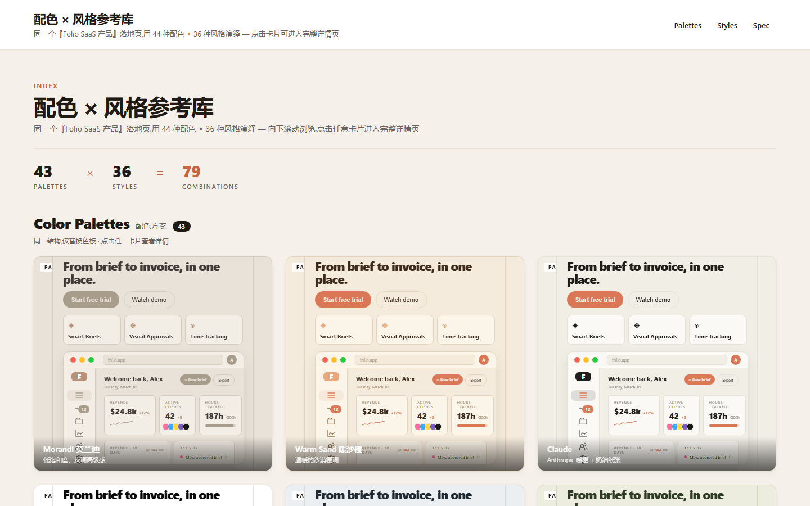
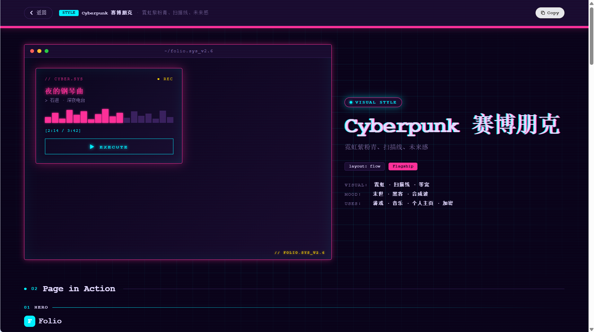
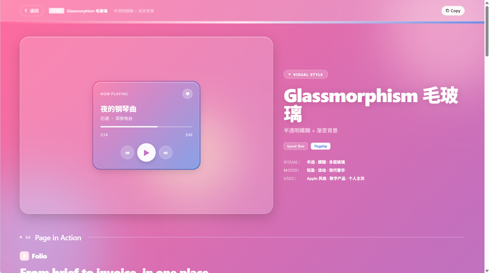
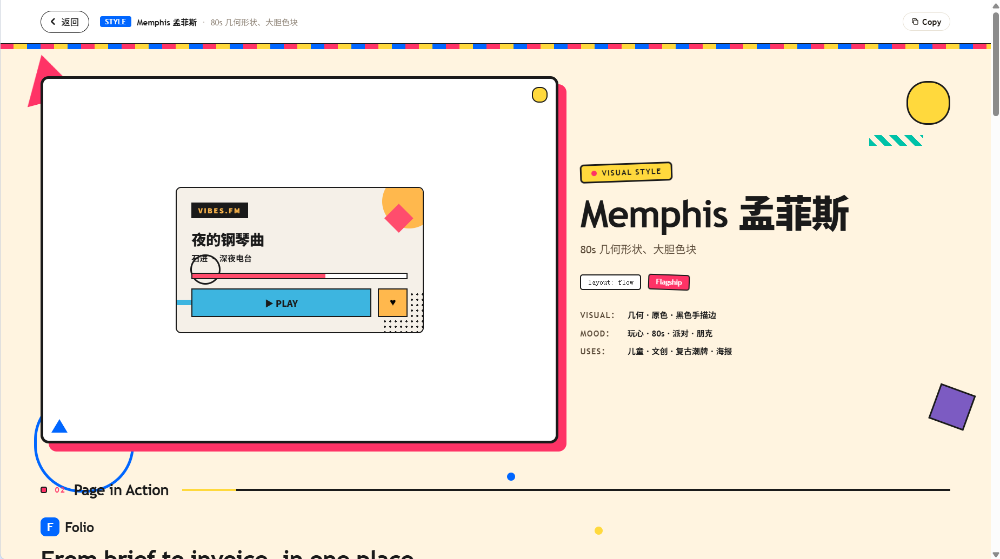
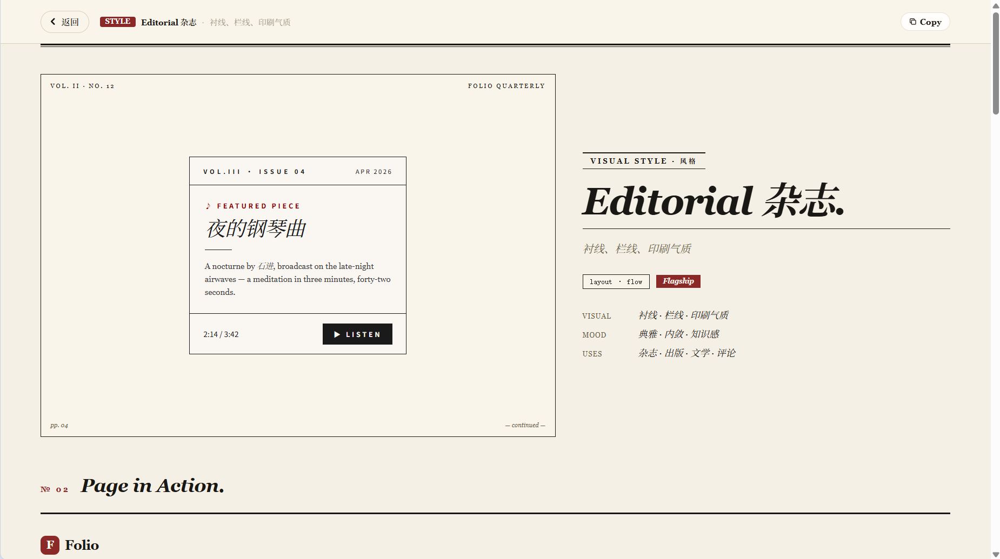
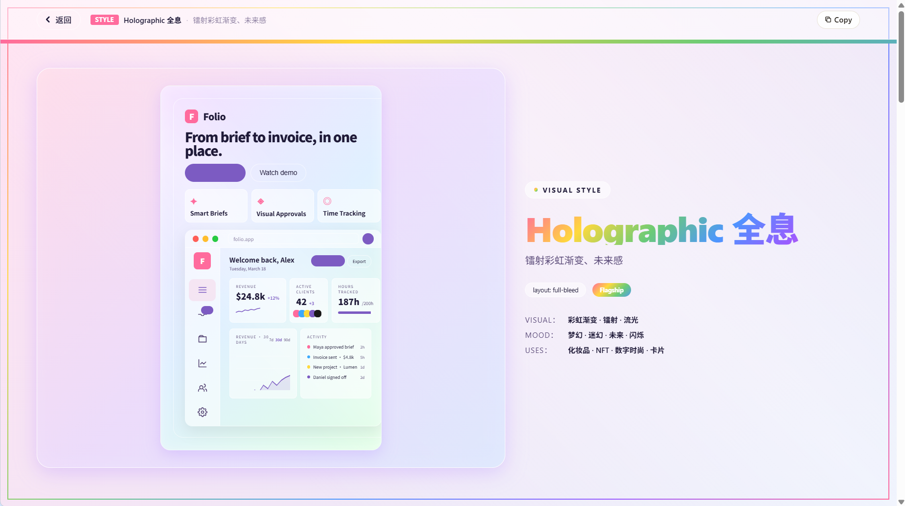
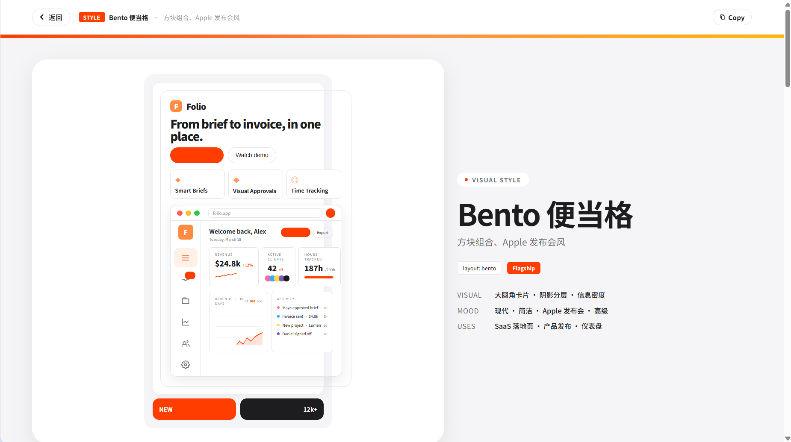
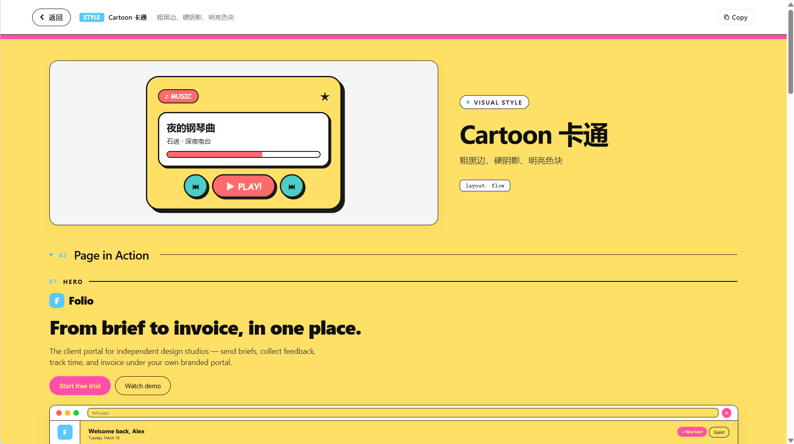

# chroma-atlas

> A visual reference library. The same SaaS landing page rendered in **43 color palettes x 36 visual styles = 79 distinct combinations**. Scroll, click any card, see the full detail page in that world.



The point of chroma-atlas is **apples-to-apples comparison**. Every card on the home page renders the exact same product (the Folio client portal) with the same content: the same hero, the same features, the same pricing tiers, the same FAQ. Only the colors and the visual treatment change. That makes it easy to see, in a single scroll, how a single design brief plays out across wildly different visual languages.

## What you get

- **43 color palettes** -- Morandi, Sakura, Cyberpunk, Matcha, Nordic, Midnight, Game Boy, Sunflower, ... covering warm/cool, light/dark, retro/forward, paper/neon.
- **36 visual styles** -- Cyberpunk, Glassmorphism, Memphis, Pixel, Bento, Editorial, Clay, Vaporwave, Holographic, Soft UI, Y2K, Sticker, Doodle, ...
- **79 combinations** -- palettes and styles are independent. Pick any palette and any style; they compose.
- **10 flagship styles** (cyber / glass / memphis / pixel / bento / editorial / clay / vapor / holo / softui) render the **whole detail page** in their own visual language -- typography, decoration, components, all themed.
- **26 standard styles** render through a shared layout flow with the per-style `theme` providing the chrome.

## The same product, three palette worlds

The Folio landing page rendered in Cyberpunk, Morandi, and Bento palettes side by side. Same structure, same hierarchy, same content -- only the colors change.


## Flagship styles: the whole page is the demo

These 10 styles are not just demo cards. Click into one and the entire detail page -- background, fonts, scrollbars, components, even the section dividers -- adopts the style's visual language.

### Cyberpunk -- neon, scanlines, monospace



### Glassmorphism -- translucent panels over a gradient



### Memphis -- 80s geometry, bold color blocks, hard shadows



### Editorial -- serif, newsprint, column rules



### Holographic -- iridescent gradients, future-sleek



### Bento -- Apple-keynote tile composition



### Cartoon -- comic-book outlines, hard shadows, primary colors



## Architecture

The project is **zero-build**. There is no webpack, no bundler, no transpilation step. React + ReactDOM + Babel are loaded as pre-built bundles from `vendor/`; every JSX file in `src/` is fetched at runtime and compiled in the browser by Babel.

```
.
|-- index.html                    bootstrap: load React, Babel, then JSX
|-- vendor/                       pre-built React + ReactDOM + Babel (offline-ready)
|-- src/
|   |-- lib/
|   |   |-- router.js             hash-based SPA router
|   |   '-- chrome.js             palette/style -> theme chrome (colors, fonts)
|   |-- data/
|   |   |-- palettes.jsx          31 color palettes
|   |   |-- palettes-3.jsx        +12 more
|   |   |-- styles.jsx            12 style demo cards (legacy)
|   |   |-- styles-2.jsx          +12 more
|   |   |-- styles-3.jsx          +12 more
|   |   '-- product.js            the Folio SaaS product content (shared)
|   |-- components/
|   |   |-- home-grid.jsx         single-scroll home: palettes + styles sections
|   |   |-- hero-header.jsx       sticky top header with anchor nav
|   |   |-- product-blocks.jsx    the SaaS landing-page blocks (HeroBlock, FeaturesBlock, ...)
|   |   |-- dashboard-mockups.jsx product UI mockups
|   |   '-- demo-card.jsx         music-player palette card
|   '-- detail/
|       |-- detail-view.jsx       dispatches to per-style page or layout flow
|       |-- layouts.jsx           8 layout modes (flow, split-hero, bento, full-bleed, ...)
|       |-- variants.jsx          variant library
|       |-- pairings.js           palette <-> style pairings
|       |-- sections/             Hero / Page-in-Action / Tokens / Variants / Pairings
|       '-- styles/               10 flagship per-style immersive pages
|           |-- _shared.jsx       chrome-agnostic scaffolding
|           |-- cyber.jsx
|           |-- glass.jsx
|           |-- memphis.jsx
|           |-- pixel.jsx
|           |-- bento.jsx
|           |-- editorial.jsx
|           |-- clay.jsx
|           |-- vapor.jsx
|           |-- holo.jsx
|           '-- softui.jsx
|-- scripts/
|   '-- copy-vendor.js            postinstall: copy node_modules/{react,react-dom,@babel} -> vendor/
|-- screenshots/                  README visuals
|-- package.json
'-- README.md
```

### How a flagship style page works

Each file under `src/detail/styles/<id>.jsx` exports a self-contained React component, wrapped in an IIFE so internal `function Hero / Page / Section / ...` declarations don't collide with the same names defined in other style files. (Babel-style `<script>` tags share global scope; the IIFE keeps each style's helpers private.)

```js
(function () {
  const theme = { bg, surface, text, sub, primary, accent, border, isDark, fontFamily, ... };

  function Hero({ item })        { return <div style={{ ...themed... }} />; }
  function PageInAction()        { return <B.HeroBlock p={PRODUCT} chrome={theme} />; }
  function Tokens({ item })      { return ...; }
  function Variants({ item })    { return <window.DetailVariants item={item} kind="style" chrome={theme} />; }
  function Page({ item, onBack }) {
    return (
      <div style={{ minHeight: '100vh', background: theme.bg, color: theme.text, fontFamily: theme.fontFamily, ... }}>
        <window.StyleShared.SharedBackBar onBack={onBack} item={item} kind="style" theme={theme} />
        <Hero item={item} />
        <PageInAction />
        <Tokens item={item} />
        <Variants item={item} />
        <window.StyleShared.SharedPairings item={item} theme={theme} currentKind="style" />
      </div>
    );
  }

  window.STYLE_PAGES = window.STYLE_PAGES || {};
  window.STYLE_PAGES.<id> = { theme, Page };
})();
```

`detail-view.jsx` checks `window.STYLE_PAGES[item.id]` and dispatches to that style's `Page` if present. Otherwise it falls back to a layout flow using the style's own `theme` for chrome.

## Running it

```bash
npm install            # also runs scripts/copy-vendor.js to populate vendor/
npm start              # python -m http.server 8080
```

Then open <http://localhost:8080/>. The home page is a single scroll with two sections (Color Palettes / Visual Styles) separated by a divider. Click any card to enter the detail page.

## Design notes

- **Same product, everywhere.** Every demo renders the Folio client portal. No fake brand swap per style -- that would hide the effect of the visual treatment.
- **Palettes and styles are independent.** A palette describes `bg / surface / text / sub / primary / accent / border / isDark`. A style describes decoration (border-radius, shadow, font, motion, ornaments). They compose.
- **Apples-to-apples.** Same hero, same features, same pricing, same FAQ. Only colors and visual treatment change. That is what makes the library useful -- you see how a single design brief plays out in 79 ways.
- **Zero build.** No webpack, no bundler. JSX is compiled in the browser by Babel Standalone. `vendor/` is committed so it works offline.

## License

MIT.
